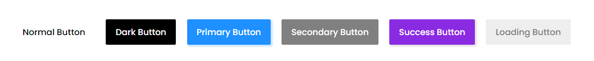
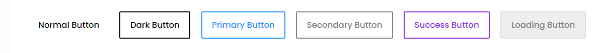
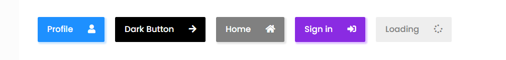
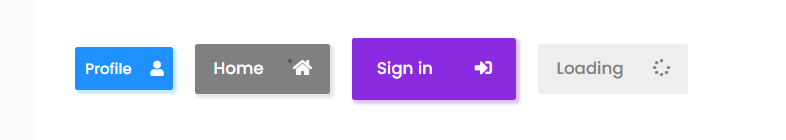

# A LIGHTWEIGHT CSS LIBRARY TO MAKE YOUR BUTTONS LOOK GOOD

## DEMO
https://buttoncss.netlify.app/

### FILLED BUTTONS
#


<br />
<br />
```
    <button class="btn">Normal Button</button>


    <button class="btn btn-dark">Dark Button</button>


    <button class="btn btn-primary">Primary Button</button>


    <button class="btn btn-greyed">Secondary Button</button>

    
    <button class="btn btn-success">Success Button</button>


    <button class="btn btn-loading" disabled>Loading Button</button>
```

### OUTLINED BUTTONS
#

<br>
<br>
```
    <button class="btn">Normal Button</button>


    <button class="btn btn-dark-outline">Dark Button</button>


    <button class="btn btn-primary-outline">Primary Button</button>


    <button class="btn btn-greyed-outline">Secondary Button</button>

    
    <button class="btn btn-success-outline">Success Button</button>


    <button class="btn btn-loading-outline" disabled>Loading Button</button>
```


### ICON BUTTONS
#

<br><br>
```
    <button class="btn-icon">Normal Button</button>


    <button class="btn-icon btn-icon-dark">Profile <span class="fas fa-user"></span></button>


    <button class="btn-icon btn-icon-primary">Home <span class="fas fa-home"></span></button>


    <button class="btn-icon btn-icon-greyed">Sign in <span class="fas fa-sign-in-alt"></span></button>

    
    <button class="btn-icon btn-icon-success">Success Button</button>


    <button class="btn-icon btn-icon-loading" disabled>Loading <span class="fas fa-spinner"></span></button>
```


### ICON SIZED BUTTONS
#

<br><br>

```
    <button class="btn-icon btn-icon-dark btn-icon-sm">Profile <span class="fas fa-user"></span></button>


    <button class="btn-icon btn-icon-primary btn-icon-md">Home <span class="fas fa-home"></span></button>


    <button class="btn-icon btn-icon-greyed btn-icon-lg">Sign in <span class="fas fa-sign-in-alt"></span></button>    

```


